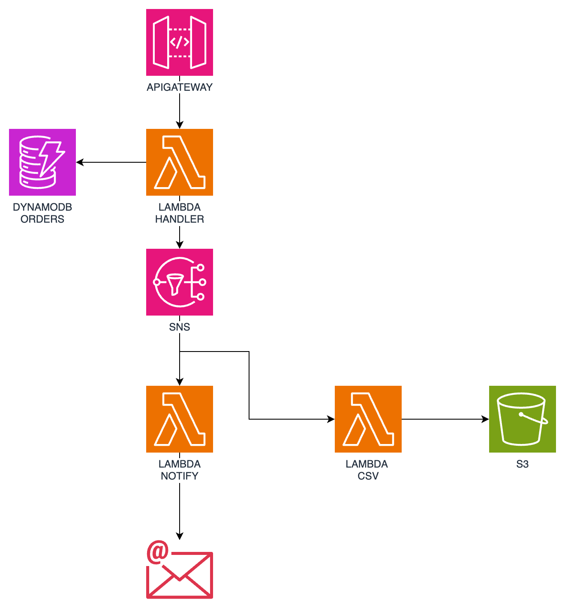

# Nombre de tu Proyecto

Proyecto de AWS Chalice que incluye integracion con terraform y unit test

## Arquitectura del ejemplo



## Instalación

Instrucciones para instalar  proyecto.

```sh
$ pyenv install 3.9
$ pyenv virtualenv 3.9.19 venv
$ source /Users/User/.pyenv/versions/3.9.19/envs/venv/bin/activate
$ pip install -r requirements.txt
```

## Comandos

Ejecucion de test

```sh
$ make test
```

Ejecucion local

```sh
$ make local
```

Despliegue con terraform

```sh
$ make deploy #crear infra
$ make destroy #eliminar infra
```